# AERIS — System Architecture

## Architecture Diagram

```mermaid
graph TD
    %% ===================== Frontend =====================
    subgraph FE["Frontend (Next.js Command Center)"]
        CC["Command Center Dashboard"]
        EVID["/evidence page (evaluation & judging metrics)"]
        ADV["/advisories page (multilingual advisory cards)"]
        CC --- EVID
        CC --- ADV
    end

    %% ===================== Backend API =====================
    subgraph BE["Backend API (NestJS / AppModule)"]
        direction TB
        subgraph MODS["Feature Modules"]
            ST["Stations"]
            AQI["AQI"]
            WX["Weather"]
            TR["Traffic"]
            GIS["GIS"]
            HS["Hotspots"]
            FC["Forecast"]
            IV["Interventions"]
            RC["Recommendations"]
            IN["Ingestion"]
            AG["Agents"]
            SAT["Satellite"]
            LU["LandUse"]
            VUL["Vulnerability"]
            EV["Evidence"]
        end

        subgraph AGENTS["Agent Layer (9)"]
            AQIA["AQIAgent"]
            WEA["WeatherAgent"]
            TRA["TrafficAgent"]
            FOR["ForecastAgent"]
            HOT["HotspotAgent"]
            SRC["SourceAttributionAgent"]
            INT["InterventionAgent"]
            CAD["CitizenAdvisoryAgent"]
            COO["CoordinatorAgent"]
        end
    end

    %% ===================== Database =====================
    subgraph DB["Database (PostgreSQL via Prisma)"]
        TBL["stations, aqi_readings, weather_data, traffic_data, satellite_readings, land_use_features, vulnerability_scores, advisories, hotspots, interventions, forecasts"]
    end

    %% ===================== External Sources =====================
    subgraph EXT["External Data Sources"]
        OAQ["OpenAQ (live AQI)"]
        OWM["OpenWeather (weather)"]
        TOM["TomTom (traffic)"]
        S5P["Copernicus Sentinel-5P (NO2/SO2)"]
        FIRMS["NASA FIRMS (MODIS thermal)"]
        OSM["OSM Overpass (land-use + POIs)"]
        LLM["LLM (Gemini / OpenAI) — multilingual advisories"]
        SYN["Synthetic Seed Data (fallback only)"]
    end

    %% ===================== Flows =====================
    FE -->|HTTP / REST| BE
    IN --> OAQ
    IN --> OWM
    IN --> TOM
    IN --> S5P
    IN --> FIRMS
    IN --> OSM
    IN -.->|fallback| SYN

    SAT --> S5P
    SAT --> FIRMS
    LU --> OSM
    VUL --> LLM

    AGENTS --> MODS
    SRC --> SAT
    SRC --> LU
    CAD --> VUL
    CAD --> LLM
    COO --> AGENTS

    MODS --> DB
    AGENTS --> DB
    EV --> DB

    BE -->|query / persist| DB
```

## Summary

AERIS is a full-stack air-quality intelligence platform: a Next.js Command Center frontend (Command Center, `/evidence`, and `/advisories` pages) talks to a NestJS backend whose feature modules (Stations, AQI, Weather, Traffic, GIS, Hotspots, Forecast, Interventions, Recommendations, Ingestion, Agents, plus the newer Satellite, LandUse, Vulnerability, and Evidence modules) orchestrate nine specialized agents. Live data from OpenAQ, OpenWeather, TomTom, Copernicus Sentinel-5P, NASA FIRMS, and OSM Overpass is normalized into PostgreSQL via Prisma, with synthetic seed data used strictly as a fallback when live APIs are unavailable or rate-limited.
